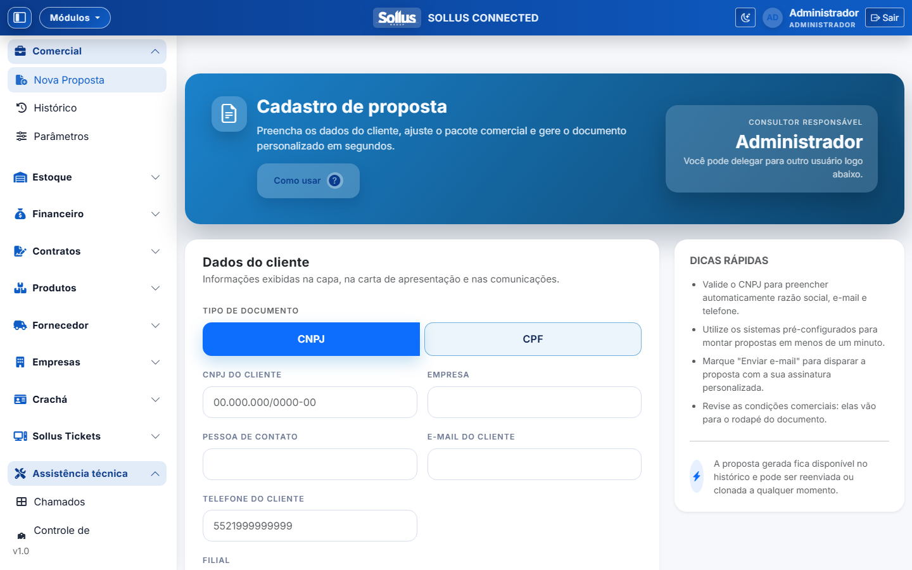
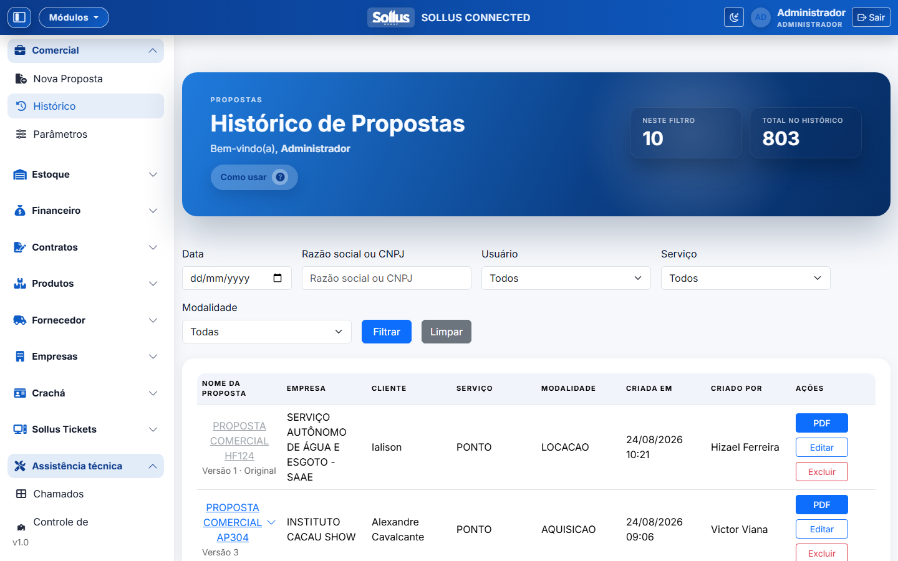
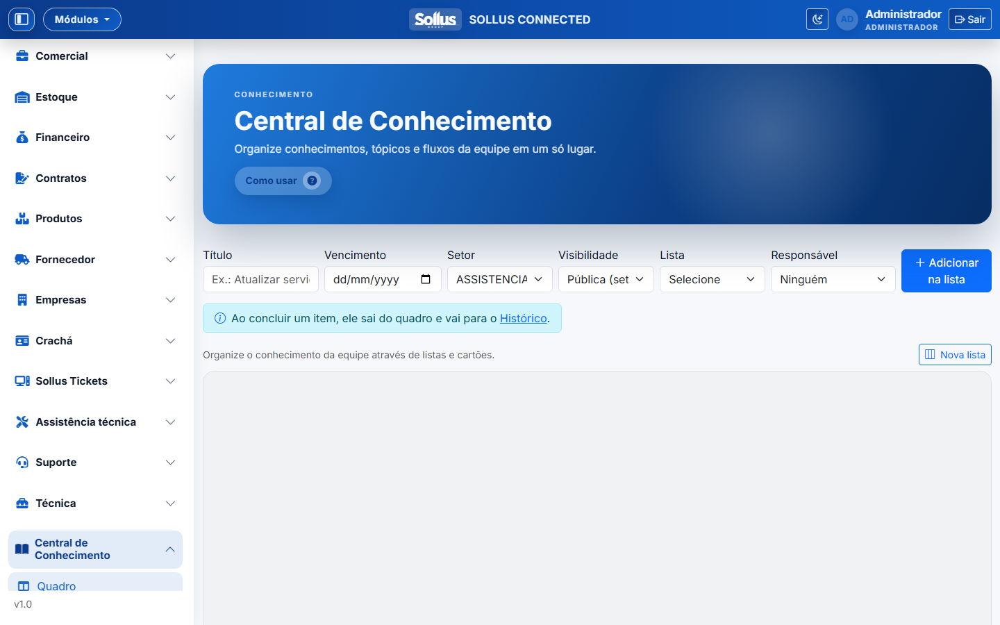
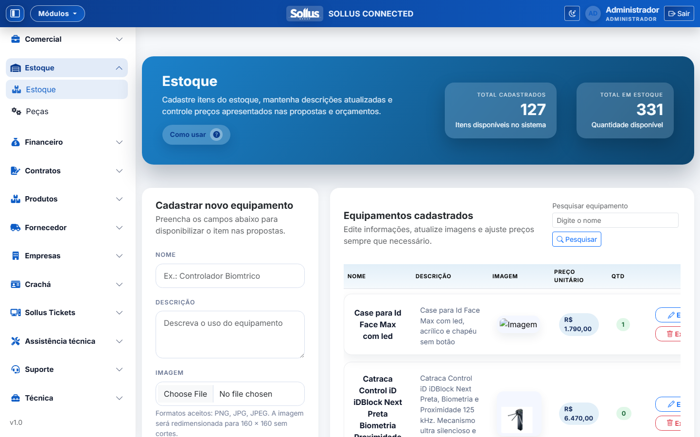
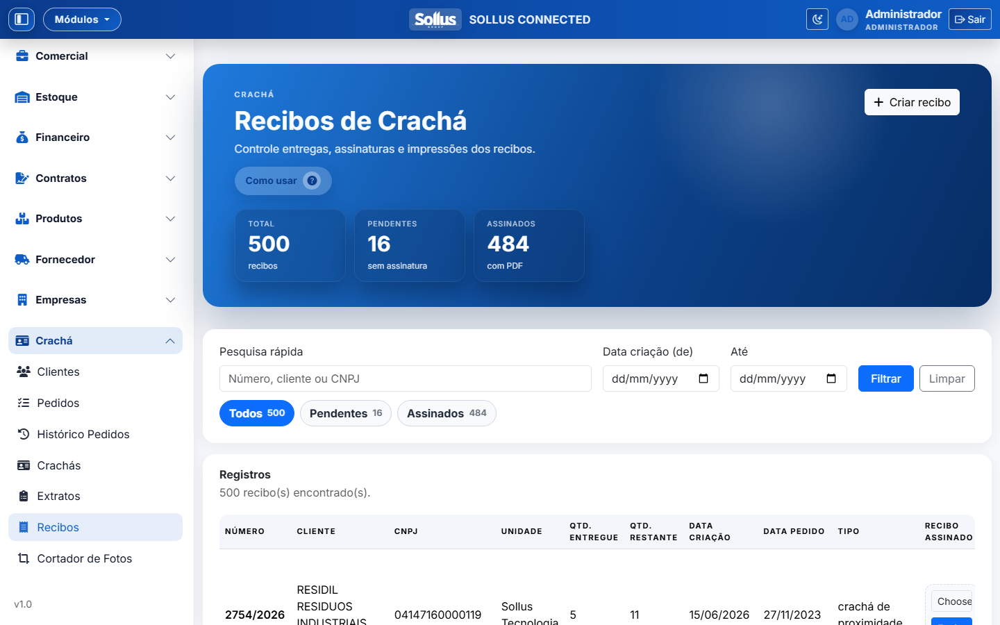
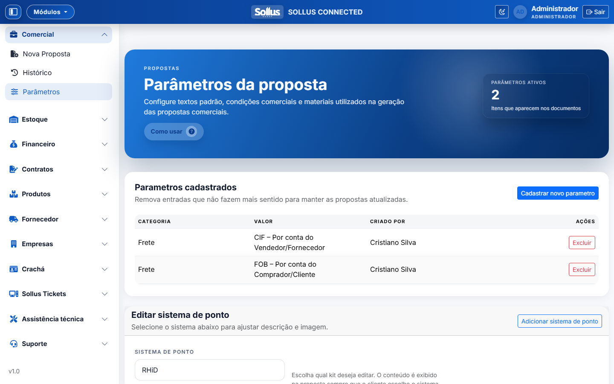
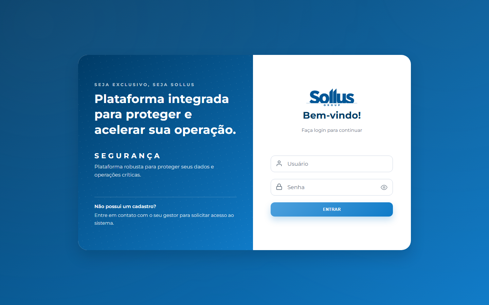
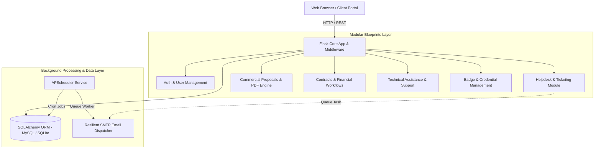

# 🏢 Connected Enterprise — Modular ERP, CRM & Helpdesk Suite

[](https://python.org)
[](https://flask.palletsprojects.com/)
[](https://www.sqlalchemy.org/)
[](https://www.mysql.com/)
[](https://getbootstrap.com/)
[](LICENSE)

> **Connected Enterprise** is a comprehensive, production-grade ERP, CRM, and Helpdesk platform designed for B2B service providers, equipment rental firms, and technical assistance operations. Built with a decoupled **Modular Flask Blueprints** architecture, it features robust ticketing, automated PDF proposal generation, financial contract management, resilient background email queuing, and granular Access Control (ACL).

## 📸 Interface Preview & Screenshots

<div align="center">

### 📊 1. Operations & Executive Dashboard


### 📑 2. Commercial Proposal & Quote Builder


### 📈 3. Proposal Pipeline & Contract Tracking


### 📋 4. Central Knowledge Base & Kanban Task Board


### 📦 5. Equipment Catalog & Inventory Management


### 💳 6. PVC Card Manufacturing & Production Receipts


### ⚙️ 7. Dynamic Business Rules & Pricing Parameters


### 🔐 8. Secure Authentication Portal


</div>

---

## 🌟 Key Highlights & Engineering Features



### 1. 🎫 Enterprise Ticketing & Helpdesk (Sollus Tickets)
* **Real-time Collision Avoidance (View Locks):** Prevents duplicate replies by locking ticket viewing and editing when another agent is actively interacting with the thread.
* **Message Editing & Versioning:** Full audit trail (`SollusTicketThreadEntryHistory`) allowing agents and managers to edit responses with automatic customer re-dispatch.
* **Granular SLA Engine:** Automated computation of response deadlines with proactive daily warnings and overdue triggers managed by background workers.
* **Dual Ingestion Engine:** Supports direct agent dashboard creation as well as automated email thread synchronization.

### 2. 📑 Dynamic Commercial Proposal & PDF Engine
* **Hybrid Acquisition vs. Rental Matrix:** Handles one-time equipment purchases, recurring software SaaS licensing, and multi-year rental contracts in a unified quote.
* **Automated PDF Compilation:** Generates pixel-perfect, branded PDF proposals, contracts, and technical datasheets via `wkhtmltopdf` / `WeasyPrint`.
* **Smart Text De-duplication:** Built-in sanitization pipeline that cleans redundant contract clauses, standardizes rights descriptions, and calculates metadata chips (Users, Devices, CNPJs, Term).

### 3. 🛡️ Granular Role-Based Access Control (ACL)
* **Multi-tiered Permissions:** Administrative, Managerial, and Agent tiers with per-feature override flags (`can_delete`, `can_edit_all`, `department_scope`).
* **Department-Scoped Visibility:** Restricts standard agents to their department's tickets while giving managers cross-functional analytics.

### 4. 📬 Resilient Background Email Queue
* **Transactional Queue (`SollusEmailQueue`):** Emails are enqueued within the database transaction, preventing message loss in case of SMTP server dropouts.
* **Exponential Backoff & Retries:** Background worker processes queued messages every minute with max-retry thresholds and error logging.

---

## 🛠️ Tech Stack

| Component | Technologies |
|---|---|
| **Backend Core** | Python 3.10+, Flask, Jinja2, Werkzeug, Gevent |
| **ORM & Database** | SQLAlchemy 2.0, Alembic, PyMySQL, SQLite (Dev) |
| **Background Tasks** | APScheduler, Gevent Monkey Patching |
| **Frontend & UI** | Bootstrap 5, Select2, Vanilla JS, Premium Glassmorphism CSS |
| **Document Generation** | `wkhtmltopdf`, `html2pdf.js`, `python-docx` |
| **Security & Auth** | Flask-Login, CSRF Protection, PBKDF2 Password Hashing |

---

## 🚀 Quick Start (Local Setup in 2 Minutes)

### 1. Clone the repository
```bash
git clone https://github.com/your-username/connected-enterprise-erp.git
cd connected-enterprise-erp
```

### 2. Create and activate virtual environment
```bash
# Windows
python -m venv .venv
.venv\Scripts\activate

# Linux / macOS
python3 -m venv .venv
source .venv/bin/activate
```

### 3. Install dependencies
```bash
pip install -r requirements.txt
```

### 4. Configure environment variables
Copy `.env.example` to `.env`:
```bash
cp .env.example .env
```

### 5. Seed the database with demo data
Run the seed script to automatically create database tables, sample departments, products, tickets, and demo users:
```bash
python seed_demo_data.py
```

### 6. Start the development server
```bash
python app.py
```
Open your browser and navigate to **`http://localhost:5000`**.

---

## 🔐 Demonstration Credentials

After running `python seed_demo_data.py`, you can log in with any of the following accounts:

| Role | Username (`usuario`) | Password | Description |
|---|---|---|---|
| 👑 **Administrator** | `admin` | `admin123` | Full access to all modules, settings, and user management. |
| 👔 **Manager** | `gestor` | `gestor123` | Department management, ticket oversight, and approvals. |
| 🛠️ **Technician / Agent** | `atendente` | `user123` | Ticket response, proposal creation, and maintenance records. |
| 🏢 **Client** | `cliente` | `client123` | Customer view for opening tickets and reviewing proposals. |

---

## 📂 Project Structure

```
├── app.py                      # Application factory & Gevent WSGI setup
├── config.py                   # Centralized environment-driven configuration
├── extensions.py               # Flask extensions (DB, Mail, LoginManager, CSRF)
├── seed_demo_data.py           # Demo dataset generator for immediate testing
├── requirements.txt            # Python dependencies
│
├── modules/                    # Decoupled Blueprint Modules
│   ├── auth/                   # Authentication & Session handling
│   ├── chamados/               # Core internal ticketing & knowledge base
│   ├── sollus_tickets/         # Helpdesk engine (SLA, Email Ingest, Threading)
│   ├── propostas/              # Commercial proposals, catalog & PDF generation
│   ├── suporte/                # Technical assistance, work orders (OS), scheduling
│   ├── contratos/              # Contract lifecycle, recurring maintenance
│   ├── financeiro/             # Accounts receivable/payable & billing quotas
│   ├── cracha/                 # PVC Card / Badge manufacturing & tracking
│   └── audit/                  # Comprehensive system-wide audit logging
│
├── templates/                  # Jinja2 HTML Templates
├── static/                     # CSS design system, JavaScript modules, assets
└── uploads/                    # Secure local file storage (.gitkeep)
```

---

## 🧪 Testing

Run the automated test suite using `pytest`:
```bash
pytest
```

---

## 📄 License
This project is open-sourced under the **MIT License**. See the [LICENSE](LICENSE) file for details.
